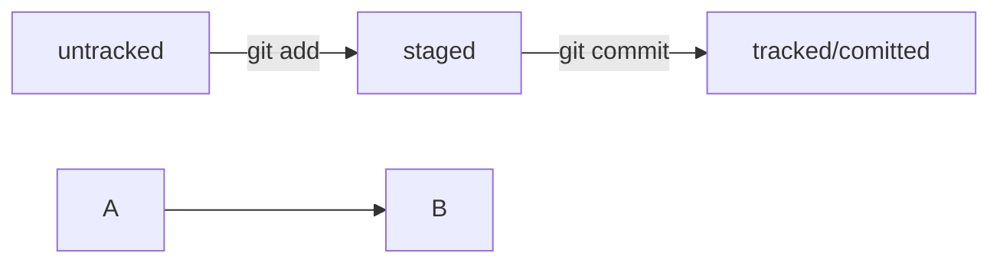

# Знакомство с GIT

[Установи необходимое ПО](https://githowto.com/ru/setup)

"Содержание инструкции"

1. Настройка
2. Инициализируем репозиторий
3. Добавляем файлы в репозиторий
4. Делаем первый коммит
5. Просматриваем историю коммитов
6. HEAD — всему голова
7. Статусы файлов в Git

